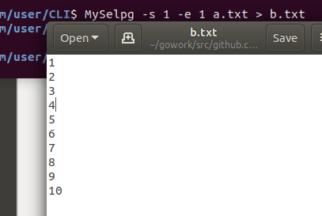

# 1.设计说明 #
在设计上其实就是按照原selpg的c代码，将其转换成go代码而已。

结构体，用来管理传入的参数
```
type  selpg_args struct {
	start_page int
	end_page int
	in_filename string
	page_len int  /* dsefault value, can be overriden by "-l number" on command line */
	page_type string  /* 'l' for lines-delimited, 'f' for form-feed-delimited */
					    /* default is 'l' */
	print_dest string
}
```

main函数
```
func main() {
	sa := sp_args{}

	/* save name by which program is invoked, for error messages */
	progname = os.Args[0] //获取输入的命令

	process_args(&sa) //对参数初始化，并检查输入参数是否合理
	process_input(sa) //根据参数处理输入的命令
}
、、、

process_args的实现
```
func process_args(sa * sp_args) {
	flag.IntVarP(&sa.start_page,"start",  "s", -1, "start page(>1)")
	flag.IntVarP(&sa.end_page,"end", "e",  -1, "end page(>=start_page)")
	flag.IntVarP(&sa.page_len,"len", "l", 10, "page len")
	flag.StringVarP(&sa.page_type,"type", "f", "l", "'l' for lines-delimited, 'f' for form-feed-delimited. default is 'l'")
	flag.Lookup("type").NoOptDefVal = "f"
	flag.StringVarP(&sa.print_dest,"dest", "d", "", "print dest")

	flag.Usage = func() {
		fmt.Fprintf(os.Stderr,
			"USAGE: \n%s -s start_page -e end_page [ -f | -l lines_per_page ]" + 
			" [ -d dest ] [ in_filename ]\n", )
		flag.PrintDefaults()
	}
	flag.Parse()
	
	/* check the command-line arguments for validity */
	if len(os.Args) < 3 {	/* Not enough args, minimum command is "selpg -sstartpage -eend_page"  */
		fmt.Fprintf(os.Stderr, "\n%s: not enough arguments\n", progname)
		flag.Usage()
		os.Exit(1)
	}

	/* handle 1st arg - start page */
	if os.Args[1] != "-s" {
		fmt.Fprintf(os.Stderr, "\n%s: 1st arg should be -s start_page\n", progname)
		flag.Usage()
		os.Exit(2)
	}
	i := 1 << 32 - 1
	if(sa.start_page < 1 || sa.start_page > i) {
		fmt.Fprintf(os.Stderr, "\n%s: invalid start page %s\n", progname, os.Args[2])
		flag.Usage()
		os.Exit(3)
	}

	/* handle 2nd arg - end page */
	if os.Args[3] != "-e" {
		fmt.Fprintf(os.Stderr, "\n%s: 2nd arg should be -e end_page\n", progname)
		flag.Usage()
		os.Exit(4)
	}
	if sa.end_page < 1 || sa.end_page > i || sa.end_page < sa.start_page {
		fmt.Fprintf(os.Stderr, "\n%s: invalid end page %s\n", progname, sa.end_page)
		flag.Usage()
		os.Exit(5)
	}

	if len(flag.Args()) == 1 {
		_, err := os.Stat(flag.Args()[0])
		/* check if file exists */
		if err != nil && os.IsNotExist(err) {
			fmt.Fprintf(os.Stderr, "\n%s: input file \"%s\" does not exist\n",
					progname, flag.Args()[0]);
			os.Exit(6);
		}
		sa.in_filename = flag.Args()[0]
	}
}
```

process_input实现
```
func process_args(sa * sp_args) {
	flag.IntVarP(&sa.start_page,"start",  "s", -1, "start page(>1)")
	flag.IntVarP(&sa.end_page,"end", "e",  -1, "end page(>=start_page)")
	flag.IntVarP(&sa.page_len,"len", "l", 10, "page len")
	flag.StringVarP(&sa.page_type,"type", "f", "l", "'l' for lines-delimited, 'f' for form-feed-delimited. default is 'l'")
	flag.Lookup("type").NoOptDefVal = "f"
	flag.StringVarP(&sa.print_dest,"dest", "d", "", "print dest")

	flag.Usage = func() {
		fmt.Fprintf(os.Stderr,
			"USAGE: \n%s -s start_page -e end_page [ -f | -l lines_per_page ]" + 
			" [ -d dest ] [ in_filename ]\n", )
		flag.PrintDefaults()
	}
	flag.Parse()
	
	/* check the command-line arguments for validity */
	if len(os.Args) < 3 {	/* Not enough args, minimum command is "selpg -sstartpage -eend_page"  */
		fmt.Fprintf(os.Stderr, "\n%s: not enough arguments\n", progname)
		flag.Usage()
		os.Exit(1)
	}

	/* handle 1st arg - start page */
	if os.Args[1] != "-s" {
		fmt.Fprintf(os.Stderr, "\n%s: 1st arg should be -s start_page\n", progname)
		flag.Usage()
		os.Exit(2)
	}
	i := 1 << 32 - 1
	if(sa.start_page < 1 || sa.start_page > i) {
		fmt.Fprintf(os.Stderr, "\n%s: invalid start page %s\n", progname, os.Args[2])
		flag.Usage()
		os.Exit(3)
	}

	/* handle 2nd arg - end page */
	if os.Args[3] != "-e" {
		fmt.Fprintf(os.Stderr, "\n%s: 2nd arg should be -e end_page\n", progname)
		flag.Usage()
		os.Exit(4)
	}
	if sa.end_page < 1 || sa.end_page > i || sa.end_page < sa.start_page {
		fmt.Fprintf(os.Stderr, "\n%s: invalid end page %s\n", progname, sa.end_page)
		flag.Usage()
		os.Exit(5)
	}

	if len(flag.Args()) == 1 {
		_, err := os.Stat(flag.Args()[0])
		/* check if file exists */
		if err != nil && os.IsNotExist(err) {
			fmt.Fprintf(os.Stderr, "\n%s: input file \"%s\" does not exist\n",
					progname, flag.Args()[0]);
			os.Exit(6);
		}
		sa.in_filename = flag.Args()[0]
	}

	
}

func process_input(sa sp_args) {
	var fin *os.File /* input stream */
	
	/* set the input source */
	if len(sa.in_filename) == 0 {
		fin = os.Stdin
	} else {
		var err error
		fin, err = os.Open(sa.in_filename)
		if err != nil {
			fmt.Fprintf(os.Stderr, "\n%s: could not open input file \"%s\"\n",
				progname, sa.in_filename)
			os.Exit(7)
		}
		defer fin.Close()
	}

	/* set the output destination */
	bufFin := bufio.NewReader(fin)
	var fout io.WriteCloser
	cmd := &exec.Cmd{}

	if len(sa.print_dest) == 0 {
		fout = os.Stdout
	} else {
		
		cmd = exec.Command("cat")
		//没法测试lp，用cat代替测试
		//cmd = exec.COmmand("lp", "-d", sa.print_dest)
		var err error
		cmd.Stdout, err = os.OpenFile(sa.print_dest, os.O_APPEND|os.O_WRONLY, os.ModeAppend)
		fout, err = cmd.StdinPipe()
		if err != nil {
			fmt.Fprintf(os.Stderr, "\n%s: can't open pipe to \"lp -d%s\"\n",
				progname, sa.print_dest)
			os.Exit(8)
		}
		cmd.Start()
	}

	/* begin one of two main loops based on page type */
	var page_ctr int

	if sa.page_type == "l" {
		line_ctr := 0
		page_ctr = 1
		for {
			line,  crc := bufFin.ReadString('\n')
			if crc != nil {
				break
			}
			line_ctr++
			if line_ctr > sa.page_len {
				page_ctr++
				line_ctr = 1
			}

			if (page_ctr >= sa.start_page) && (page_ctr <= sa.end_page) {
				_, err := fout.Write([]byte(line))
				if err != nil {
					fmt.Println(err)
					os.Exit(9)
				}
		 	}
		}  
	} else {
		page_ctr = 1
		for {
			line, crc := bufFin.ReadString('\n')
			//txt 没有换页符，使用\n代替，而且便于测试
			//line, crc := bufFin.ReadString('\f')
			if crc != nil {
				break
			}
			
			if (page_ctr >= sa.start_page) && (page_ctr <= sa.end_page) {
				_, err := fout.Write([]byte(line))
				
				if err != nil {
					os.Exit(5)
				}
			}
			page_ctr++
		}
	}
	cmd.Wait()
	defer fout.Close()
	/* end main loop */
	if page_ctr < sa.start_page {
		fmt.Fprintf(os.Stderr,
			"\n%s: start_page (%d) greater than total pages (%d)," +
			" no output written\n", progname, sa.start_page, page_ctr)
	} else if page_ctr < sa.end_page {
		fmt.Fprintf(os.Stderr,"\n%s: end_page (%d) greater than total pages (%d)," +
		" less output than expected\n", progname, sa.end_page, page_ctr)
	}
}
```

# 2.测试 #

1. MySeplg -s 1 -e 1 a.txt

2. MySelpg -s 1 -e 1 < a.txt

3. cat a.txt | MySelpg -s 1 -e 1

4. MySelpg -s 1 -e 1 a.txt >b.txt

5. MySelpg -s 1 -e 11 a.txt 2>error.txt（a.txt只有100行）

6. MySelpg -s 0 -e 1 a.txt >b.txt 2>error.txt

7. MySelpg -s 1 -e 1 a.txt >b.txt 2>/dev/null

8. MySelpg -s 1 -e 1 a.txt >/dev/null

9. MySelpg -s 1 -e 1 a.txt | wc

10. MySelpg -s 1 -e 1 a.txt 2>error.txt | wc

11. MySelpg -s 1 -e 1 -l 3 a.txt

12. MySelpg -s 1 -e 1 -f a.txt

13. MySelpg -s 1 -e 1 -d lp1 a.txt

